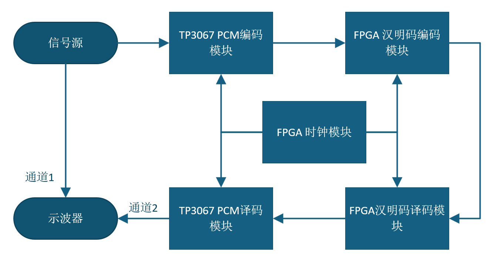

# 基于 FPGA 与 TP3067 的 PCM 音频编译码与纠错系统

> **📌 项目背景：** 《通信原理》综合实验设计项目
> **👨‍💻 核心开发：** 柳晓阳（河北大学 电子信息工程学院）

## 📖 项目概述
本项目旨在构建一个高可靠性的数字语音传输系统。系统基于“模拟信号数字化传输 + 纠错 + 模拟还原”的核心架构，在硬件层利用 **TP3067 芯片**完成音频信号的 A 律 13 折线 PCM 编译码，在逻辑层利用 **Xilinx Artix-7 FPGA** 完成 (7,4) 汉明码的编码、误码注入与纠错译码。

系统有效解决了多时钟域异步传输的亚稳态问题，并实现了严格的位同步与帧同步，最终实现音频信号的低延迟、无损还原传输。
## 📐 系统整体架构框图

## ✨ 核心技术特性

### 1. 硬件级 PCM 编解码与信号调理
* **高精度转换：** 采用集成度极高的 TP3067 芯片，支持 8kHz 采样率下的 8-bit PCM 串行码流输出与接收。
* **双电源架构：** 硬件板载 MAXIM7660 电荷泵，将输入的 +5V 稳定转换为 -5V，为 TP3067 提供纯净的 ±5V 双电源支撑。

### 2. (7,4) 汉明码纠错引擎 (FPGA 逻辑)
* **硬核纠错：** 在发送端生成 3 位校验位并打包为 7 位汉明码；在接收端利用**独热码状态机**实时计算校验子，精准定位并翻转纠正单比特错误。
* **错误注入测试：** 编码端内置动态错误注入逻辑（`error_add`），便于在示波器上直观观测系统的纠错鲁棒性。

### 3. 高精度时钟树与跨时钟域同步 (CDC)
* **时钟链路：** 摒弃普通 PLL，采用高精度 **MMCM IP 核**将 50MHz 主时钟转化为 8.192MHz，随后通过自定义分频器级联输出精准的 2.048MHz、128kHz、64kHz 及 8kHz 帧/位同步时钟。
* **双 FIFO 缓冲架构：** 巧妙使用两级异步 FIFO 隔离 64kHz（收发节点）与 128kHz（内部处理节点），彻底消除数据丢失与亚稳态。
* **相位对齐：** 针对帧同步信号（FSX/FSR），在 FPGA 内部实现精确的 25 个时钟周期延迟匹配，确保收发端数据帧完美对齐。

## 🗂️ FPGA 核心模块说明

| 模块名称 | 功能描述 | 核心逻辑要点 |
| :--- | :--- | :--- |
| `top.v` | 系统顶层整合 | 时钟树路由、分频器级联、25 拍延时逻辑及编译码器例化 |
| `coder.v` | 汉明码编码器 | 串并转换、FIFO 跨时钟写入、偶校验生成及串行并转串输出 |
| `decoder.v` | 汉明码译码器 | 校验子解算、单比特纠错独热码状态机及错误标志位抛出 |
| `divider.v` | 参数化分频器 | 支持 `div_ratio` 和 `duty_cycle` 动态配置，生成占空比精准的同步信号 |

## 📊 系统实测性能指标
* **端到端延迟：** 实测总延迟仅为 **0.45 ms**（满足 ≤ 0.5ms 指标要求）。
* **传输可靠性：** 在无错误注入下，系统误码率 $\le 10^{-6}$；在开启单比特错误注入时，纠错成功率达 100%，还原的 1kHz 正弦波与原始输入频率、相位一致。
